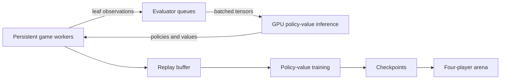
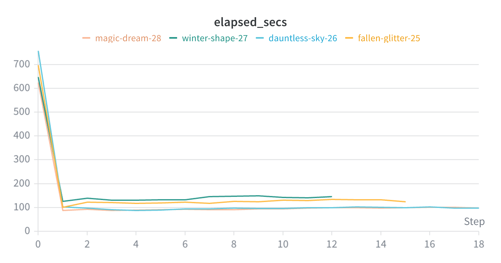
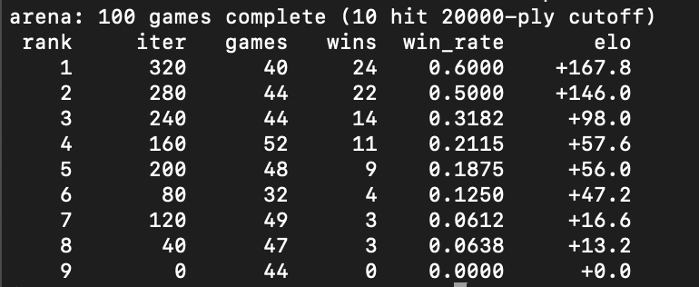

# Parallel AlphaZero for Catan

[](https://github.com/Jaime888888/jaime-catan/actions/workflows/ci.yml)

A Rust research prototype that adapts AlphaZero-style self-play and Monte Carlo Tree Search (MCTS) to four-player Catan, then parallelizes the self-play pipeline across CPU game workers and batched GPU inference.

> **Project status:** Experimental research code. The repository provides a Catan simulator, training pipeline, checkpointing, and arena evaluation; it is not a graphical or human-playable game client.

[Read the full EE 451 project report](docs/EE451-Catan-AlphaZero-Report.docx)

## Project context

This work was completed for **EE 451: Parallel and Distributed Computing** at the University of Southern California in spring 2026. The report and implementation were produced by **Brennen Ho, Jason Wiemels, Jeremy Sedillo, and Jaime Martin**.

The research question was twofold:

1. Can an AlphaZero-style system be adapted from deterministic, two-player games to four-player, stochastic Catan?
2. Can CPU-side game simulation and MCTS be organized to keep batched GPU inference busy?

## What the project implements

- A four-player Catan rules engine with randomized boards, dice, harbors, the robber, development cards, longest road, largest army, and victory-point tracking
- A fixed **254-action** policy space and **626-value** observation encoding
- Multiplayer PUCT search with vector-valued outcomes, virtual loss, and root Dirichlet exploration
- Parallel self-play with persistent game workers and dedicated evaluator threads
- Batched policy-value inference using the [Burn](https://burn.dev/) deep-learning framework
- A 2 Mi-sample replay buffer, checkpointed training, and optional Weights & Biases metrics
- Arena evaluation using four-seat matches and online Plackett-Luce ratings on an Elo-style scale

## System design



Each game worker owns its game and search-tree state. During MCTS, workers select leaves on the CPU, apply virtual loss so concurrent searches do not collapse onto the same path, and submit observation batches to evaluator threads. The evaluators run the expensive neural-network forward passes and return policy/value predictions to the workers for expansion and backpropagation.

### State and network representation

The Catan-specific network divides the 626-value observation into seven semantic regions before fusion:

| Region | Encoded information |
| --- | --- |
| Tiles | Resource type and dice-number features for 19 hexes |
| Vertices | Occupancy and ownership for 54 intersections |
| Edges | Road occupancy and ownership for 72 edges |
| Harbors | Harbor type and placement |
| Self | Hand, development cards, army/road state, and player features |
| Opponents | Compact features for the other three seats |
| Metadata | Turn, phase, and global state |

The seven branches are encoded independently, concatenated into a 384-wide trunk, passed through four fully connected residual blocks, and split into a 254-way policy head and a four-value multiplayer value head.

## Experimental results

The project report compared four iterations of the self-play pipeline. Replacing the original scatter-join design with persistent game workers and dedicated evaluator threads reduced steady-state iteration time from approximately **145 seconds to 95 seconds**, a reported **1.53x speedup** on the tested H100 system. The optimized version also produced larger GPU batches and fewer dispatches while preserving comparable training-loss behavior.



Longer training runs showed policy and total loss falling from roughly 2.85 toward 1.90 over 600+ iterations. In a 100-game checkpoint arena, later checkpoints generally ranked above earlier checkpoints; iteration 320 led the reported table with a 60% win rate in its sampled games.



These figures summarize the experiments documented in the [full report](docs/EE451-Catan-AlphaZero-Report.docx). They are historical experiment results, not a benchmark guarantee for the current defaults or other hardware.

## Workspace layout

| Path | Package | Responsibility |
| --- | --- | --- |
| `sim/` | `catan-sim` | Board topology, state transitions, legal actions, observations, display, and rule tests |
| `az/` | `az` | Generic game interface, MCTS, replay buffer, parallel self-play, and training loop |
| `src/` | `catan` | Catan adapter, observation encoder, policy-value network, and training entry point |
| `src/bin/arena.rs` | `arena` | Checkpoint-versus-checkpoint evaluation |
| `run.job` | - | Example Slurm/CUDA training job |
| `test.job` | - | Shorter Slurm/CUDA experiment job |

## Current training defaults

The current code is configured independently from some of the report's historical experiment runs.

| Setting | Current value |
| --- | ---: |
| Games per iteration | 256 |
| MCTS simulations per move | 576 |
| Leaves per evaluation batch | 48 |
| Evaluator threads | 4 |
| Replay capacity | 2,097,152 samples |
| Training batch size | 256 |
| Training steps per iteration | 512 |
| Learning rate | `2e-4` |
| Maximum plies per game | 2,500 |
| Root Dirichlet noise | epsilon `0.25`, alpha `0.3` |

## Build and test

### Requirements

- A current stable Rust toolchain with Rust 2024 edition support
- A supported Burn backend:
  - Metal on macOS
  - Vulkan by default on Linux and Windows
  - CUDA on compatible Linux or Windows systems with `--features cuda`

```bash
git clone https://github.com/Jaime888888/jaime-catan.git
cd jaime-catan
cargo build --release
cargo test --workspace
```

The test suite includes Catan rule and transition tests plus an end-to-end Tic-Tac-Toe test for the reusable AlphaZero engine.

## Train an agent

Run with the platform's default backend:

```bash
cargo run --release --bin catan -- --checkpoint-dir ./checkpoints
```

Run with CUDA:

```bash
cargo run --release --features cuda --bin catan -- \
  --checkpoint-dir ./checkpoints
```

Checkpoints are saved every ten iterations. Resume from one with:

```bash
cargo run --release --bin catan -- \
  --checkpoint-dir ./checkpoints \
  --load ./checkpoints/iter_00010.bin
```

If `WANDB_API_KEY` is available in the environment, the trainer logs experiment metrics to Weights & Biases. Training continues without remote logging when the variable is absent. Never commit API keys.

## Compare checkpoints

The arena loads `iter_*.bin` checkpoints, samples four distinct models per match, rotates them through the four seats, and updates their relative ratings:

```bash
cargo run --release --bin arena -- --checkpoints ./checkpoints
```

At least four checkpoints are required. Arena constants such as game count, display behavior, maximum plies, and seed are currently defined in `src/bin/arena.rs`.

## Limitations and future work

- Player-to-player negotiation and trading are intentionally omitted; bank trading is supported.
- The agent trains against copies of itself rather than a diverse opponent league.
- Very long games may reach the configured ply cutoff.
- A stronger imperfect-information treatment would require belief sampling or information-set MCTS.
- Multi-GPU evaluation and training remain future work.

## Generated data

The repository ignores common local outputs:

- `target/` - Rust build artifacts
- `checkpoints/` - saved model checkpoints
- `gladiators/` - generated evaluation data
- `flamegraph.svg` - profiling output

## License and trademark notice

No open-source license is currently provided. Catan is the property of its respective trademark and copyright holders. This independent research project is not affiliated with or endorsed by Catan Studio or Catan GmbH.
